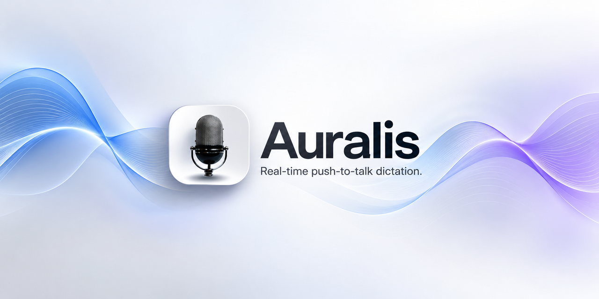

<p align="center">
  
</p>

<p align="center">
  <a href="https://github.com/Sagexd08/Auralis/actions/workflows/ci.yml">
    
  </a>
</p>

Push-to-talk dictation for Windows. Hold **Ctrl+Space**, speak, release — cleaned-up
transcribed text is inserted into whatever application currently has focus. Or tap
**Ctrl+Shift+Space** for hands-free continuous dictation.

Auralis runs entirely on-device: no cloud STT, no cloud LLM cleanup, no telemetry.

## How it works

```
MIC → VAD → DENOISER → STT → TEXT CLEANUP → KEYBOARD INSERTION
```

- **Mic capture** — [cpal](https://github.com/RustAudio/cpal), default input device
- **VAD** — [webrtc-vad](https://github.com/valenzuela/webrtc-vad) trims leading/trailing silence
- **Denoise** — RNNoise via [nnnoiseless](https://github.com/jneem/nnnoiseless) (pure Rust)
- **STT** — [whisper.cpp](https://github.com/ggerganov/whisper.cpp) via [whisper-rs](https://github.com/tazz4843/whisper-rs), quantized GGUF weights, beam search with temperature fallback, optional CUDA acceleration
- **Text cleanup** — local rules only: capitalization, terminal punctuation, disfluency removal, and a spoken-correction heuristic ("actually, change X to Y")
- **Insertion** — simulated keystrokes via [enigo](https://github.com/enigo-rs/enigo), with a clipboard fallback. A spoken correction backspaces the text Auralis just typed and replaces it in place

### Text cleanup modes

How much the text layer is allowed to rewrite what you said is a setting
(tray **Settings → Text cleanup**). `raw` always stays available, so the
transcript can be inspected without any rules in the way:

| mode | disfluencies removed | capitalized | terminal punctuation |
|---|---|---|---|
| `raw` | no | no | no |
| `clean` *(default)* | no | yes | yes |
| `polished` | yes | yes | yes |
| `developer` | yes | no | no |

`developer` exists because dictating `cargo test --locked` into a terminal
should not acquire a trailing period. Disfluency removal is deliberately
conservative — only tokens that are not also ordinary English words, so
"summary" and "ahead" survive while a standalone "um" does not.

### Audio quality analysis

Every utterance is measured before VAD trimming and denoising, and reported at
`debug` level (`RUST_LOG=auralis_runtime=debug`): speech-to-noise ratio in dB,
the fraction of frames the VAD called speech, RMS level, and whether the input
clipped — clipping also warns, since it is the most common fixable cause of bad
transcripts. SNR reads `n/a` rather than a fabricated number when the buffer has
no speech frames or no noise frames to compare against.

### Accuracy knobs

The single biggest lever is model size. `base.en` (~59 MB) is the fast default;
`small.en` (~190 MB) is noticeably better on proper nouns and accented speech at
roughly 3x the decode cost:

Auralis never downloads models. Put your own ggml `.bin` file in the per-user app data
`models` folder (the repo's `models/` folder is also searched in dev builds). Any model
there appears in the **Active model** picker. Decoding
uses beam search (width 5) with whisper.cpp's temperature-fallback thresholds and
`no_context`, which together suppress the repetition loops that greedy decoding
with cross-utterance context is prone to.

This is the Phase 1 vertical slice described in
[`docs/superpowers/specs/2026-10-01-phase1-vertical-slice-design.md`](docs/superpowers/specs/2026-10-01-phase1-vertical-slice-design.md):
a real, daily-usable dictation tool built on an existing open STT model, not a
custom-trained model or a full distributed system.

## Repo layout

```
runtime/core/         auralis-runtime — reusable Rust library (capture, VAD, denoise, STT, text cleanup, pipeline)
apps/desktop/          Tauri 2 desktop app — tray-only, global hotkey, keystroke injection
benchmarks/            Python WER/CER/RTF harness — does VAD+denoise actually help? (see benchmarks/README.md)
models/                local GGUF model weights (gitignored)
docs/superpowers/      design doc and implementation plan for this phase
```

The Rust workspace has two members so pipeline logic lives in `runtime/core`
independent of the Tauri app shell — see the design doc for the full rationale.

## Status

Phase 1 is implemented task-by-task per
[`docs/superpowers/plans/2026-10-01-push-to-talk-dictation.md`](docs/superpowers/plans/2026-10-01-push-to-talk-dictation.md),
and the phases after it have since extended it past that plan's original scope.

**Phase 1 — vertical slice**

- [x] Workspace skeleton
- [x] Resampling utility (rubato)
- [x] Mic capture (cpal)
- [x] VAD-based silence trimming
- [x] RNNoise denoising
- [x] STT via whisper.cpp
- [x] Text cleanup rules
- [x] Pipeline orchestration
- [x] Tauri desktop app scaffold
- [x] Global hotkey, pipeline wiring, keyboard injection
- [x] Manual end-to-end verification (live mic, push-to-talk and continuous)

**Phase 2 — measurement**

- [x] WER/CER/RTF benchmark harness (`benchmarks/`) with a `auralis-bench-cli` runner

**Phase 3 — dictation UX**

- [x] Toggle/continuous dictation via VAD stream segmentation (Ctrl+Shift+Space)
- [x] Tray icon, settings window, persisted config (hotkeys, model, mic device)
- [x] In-place spoken correction — backspaces what Auralis typed and replaces it
- [x] Text cleanup modes — `raw` / `clean` / `polished` / `developer`
- [x] Audio quality analysis — SNR, speech ratio, clipping, RMS

**Phase 4 — shipping**

- [x] GitHub Actions CI (runtime tests + Linux Tauri build)
- [x] Brand assets (app icon, banner)
- [x] STT accuracy pass (beam search, no_context, temperature fallback)
- [x] GPU build switches — `--features cuda` / `--features vulkan` forward to whisper.cpp (untested here: needs the toolkit installed; the default CPU build is unaffected)
- [x] Windows installer + release automation — `.github/workflows/release.yml` builds an NSIS installer on a `v*` tag; signs it when `WINDOWS_CERTIFICATE` / `WINDOWS_CERTIFICATE_PASSWORD` secrets are set, otherwise ships unsigned
- [x] Local transcription API — `auralis-server` (`POST /v1/transcriptions`)
- [x] Installed-app readiness — runtime model resolution from local files, single instance, status overlay, fixed settings/status windows (they could not load their scripts), hotkey race guards, safe settings save with hotkey rollback

## Building

Requires: Rust (stable, `x86_64-pc-windows-msvc`), Node.js + npm (for the Tauri
frontend), CMake, and a `libclang` compatible with `bindgen` 0.69 (needed to build
`whisper-rs-sys`, which compiles whisper.cpp from source). A CUDA Toolkit is only
needed for GPU acceleration.

**`libclang` note:** a too-new LLVM/clang install (e.g. 20+) produces broken bindgen
output for `whisper-rs-sys` — opaque structs with only an `_address` field, failing
with dozens of `no field ... on type whisper_full_params` errors. If you hit that,
install a compatible libclang and point `LIBCLANG_PATH` at it, e.g.:

```powershell
pip install --user libclang
setx LIBCLANG_PATH "%APPDATA%\Python\Python313\site-packages\clang\native"
# open a new terminal so the env var takes effect, then build
```

```powershell
# Rust library + tests
cargo build -p auralis-runtime
cargo test -p auralis-runtime

# Put a ggml model file in models/ first

# Desktop app
cd apps/desktop
npm install
npm run tauri dev
```

## Download

Grab the Windows installer from the [Releases page](https://github.com/Sagexd08/Auralis/releases/latest) or the project website. Add a speech model file to the models folder before first use.

## Local API

`auralis-server` exposes the same pipeline over HTTP, bound to loopback:

```powershell
cargo run --release -p auralis-runtime --bin auralis-server -- --model models/ggml-base.en-q5_1.bin

curl --data-binary "@meeting.wav" -H "Content-Type: audio/wav" "http://127.0.0.1:8787/v1/transcriptions?cleanup=clean"
```

`GET /healthz` reports the loaded model. The body is a WAV file (any sample rate, mono or multi-channel); the response is JSON with `text`, `duration_s`, `processing_s` and `model`.

## Contributing

Auralis is open source under the [MIT license](LICENSE). See [CONTRIBUTING.md](CONTRIBUTING.md) to get started, and [SECURITY.md](SECURITY.md) to report a vulnerability.

## Benchmark harness (Phase 2)

Measures whether VAD+denoise actually helps STT accuracy rather than assuming
it does — WER/CER/RTF across model size x raw/vad-denoise x clean/noisy. See
[`benchmarks/README.md`](benchmarks/README.md).

## Still out of scope

The original product plan describes a far larger system. Per its own
§53, the model and the dictation loop come before the infrastructure, so none of
the following is built yet:

- A custom-trained STT model — Auralis currently runs existing whisper.cpp weights
- TTS, and the voice feedback loop around it
- macOS / Linux support — the desktop app is Windows-targeted
- Cloud LLM text polish; all text cleanup is local rule-based
- Self-hosted compute fabric: node agent, scheduler, model routing, Triton, K8s
- Mobile (Android / iOS) and the quantized Nano model
- Dictated-symbol mapping in `developer` mode ("open paren" → `(`)
- Reverb scoring and noise classification in the audio quality analyzer — both
  need trained models, so they are absent rather than stubbed
